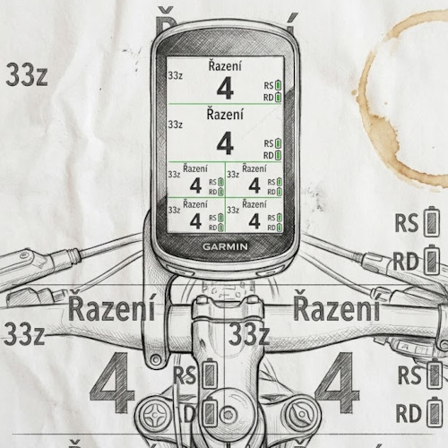

# Title
*Maximum 50 Characters*
SlavicsGearIndex

# Description
*Maximum 4000 Characters*
Zobrazení aktuálního zařazeného pastorku pouze na zadní přehazovačce. Index přehazovačky se bere z univerzálně z AntPlus (Shimano Di2, SRAM AXS,...).
Aplikace je nezávislá na počtu pastorků. Zobrazení počtu zubů na pastorku je volitelné v Nastavení aplikace.
Při změně řazení na jiný pastorek je barva šedivá. Krajní pastorky jsou zobrazeny tmavou červenou barvou.

Lokalizace EN, DE, CZ, PL, SK, IT, FR, HU.

Pokud je chybný překlad, omluvte mě a prosím kontaktujte mě se správným výrazem (V anglickém nebo českém jazyce).

Zkoušeno na přehazovačce SRAM Transmission GX.

Aplikace nepodporuje přední přesmykač!

Zobrazení
* Vpravo nahoře - aktuální počet zubů na kazetě - volitelné.
* Vpravo dole - chyby přehazování (max. 10sec při chybě) v pořadí Shift failures / Invalid inboard shifts / Invalid outboard shifts - Volitelné
* Vlevo dole  - stavy baterií systému

Děkuji Petr

Hlášení chyb, problémů nebo požadavků:

https://github.com/sla75/SlavicsRearGearIndexSimple/issues

Zobrazení:

Hodnota
*    -- - No connect AntPlus.ShiftingStatus
*    xx - No exists AntPlus.ShiftingStatus

# *What’s New (Optional)*
Maximum 4000 Characters

# *Hero Image (Optional)*
Add an image optimized for mobile devices to advertise your app. The image (JPG, GIF or PNG) has to be 1440x720 pixels large and can have a maximum size of 2048 KB.

# Cover Image & Icons
This cover image will be displayed on your Connect IQ Store listing on the Web and the Connect IQ App Store mobile app. Image must be a JPG, GIF or PNG less than 300 KB.
Cover Image (Web/Mobile)
(500 x 500)

# Screen Images
Screen images will be displayed on your app’s detail page in the Connect IQ Store. Image must be a JPG, GIF or PNG less than 150 KB.

# *Additional Hardware Requirements (Optional)*
If this app requires additional hardware, you can link to a web page that sells the hardware.
Product URL:
https://www.sram.com/en/sram/mountain/collections/eagle-transmission
